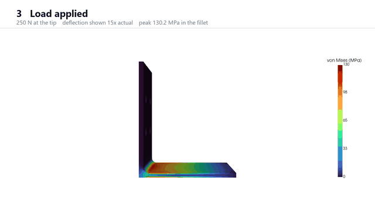
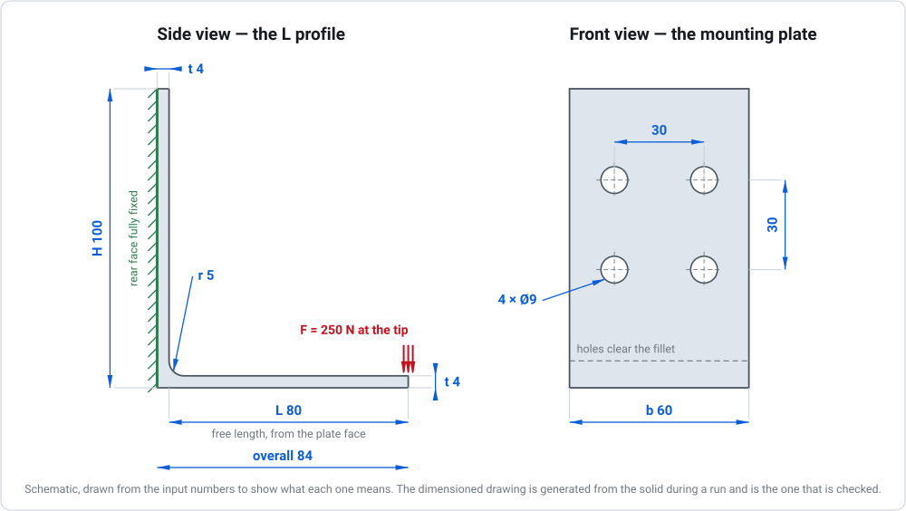
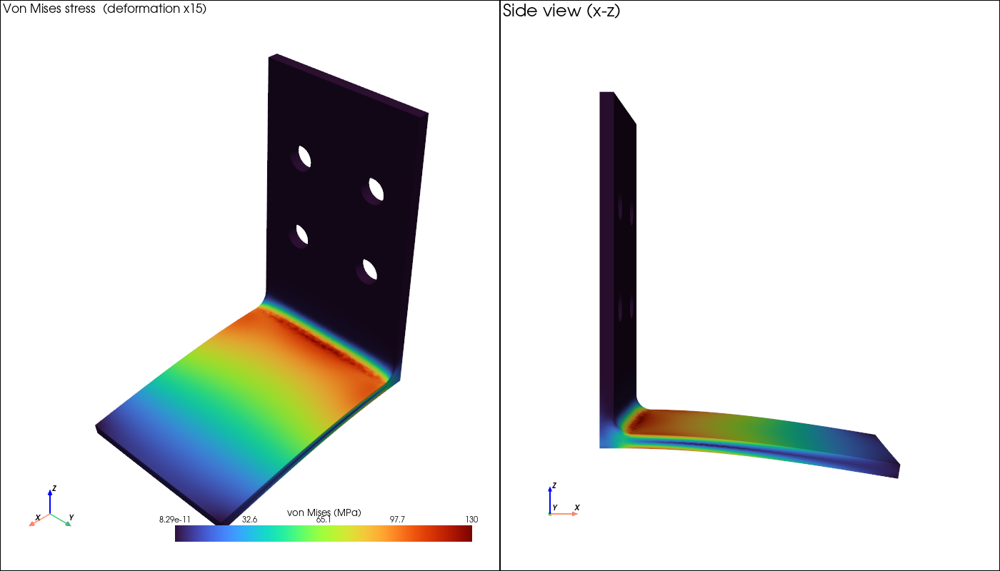
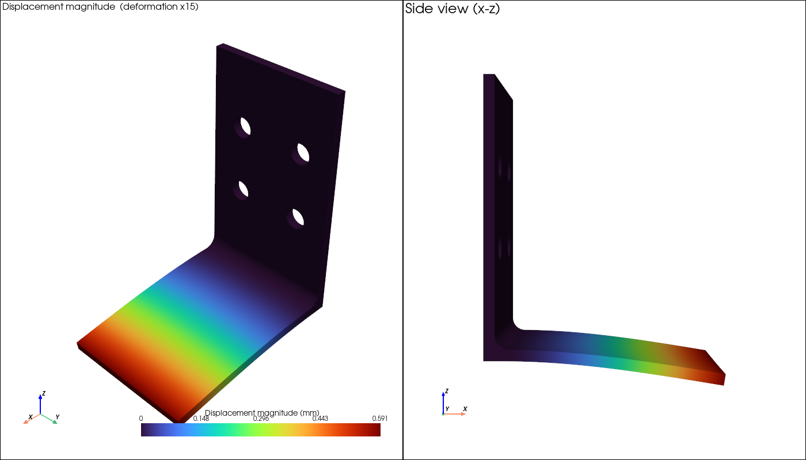
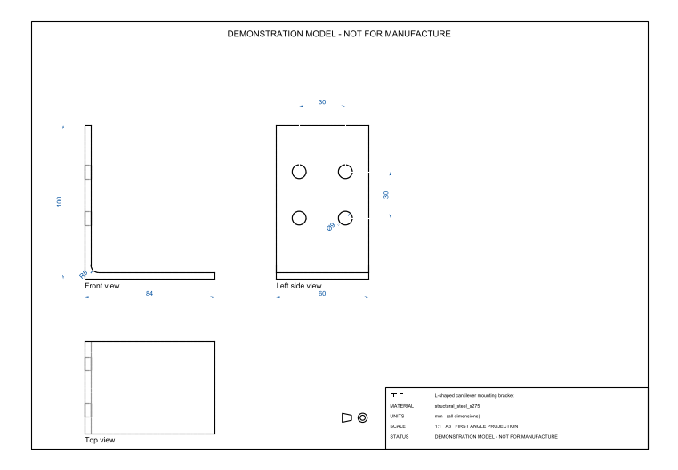
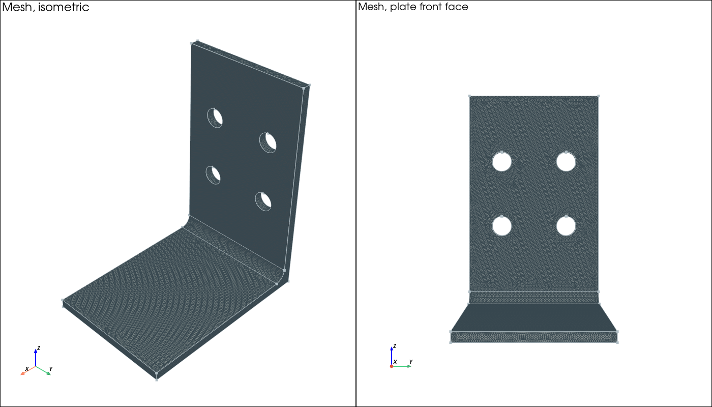

# Parametric CAD-to-CAE automation: mounting bracket

One button turns validated design inputs into geometry, a mesh, a finite
element solve, engineering checks against hand calculations, a manufacturing
drawing and an HTML report with a **Pass / Review / Fail** verdict.

This project demonstrates a general engineering automation architecture
applicable to configurable brackets, supports, enclosures and similar
manufactured components.

> **Demonstration project.** Not a certified or release-ready
> engineering tool. Every result requires independent engineering verification
> and is not suitable for product release or safety certification. See
> [docs/limitations.md](docs/limitations.md).

> **About the name.** The repository is called `rfq-to-cae-automation` because
> that is the shape of the problem it is built towards: an enquiry arrives,
> and a checked analysis should come back without a person driving five tools
> by hand. **The RFQ stage itself is not in this repository.** Reading a
> written enquiry and turning it into validated parameters is the next step on
> the roadmap, not something you will find in the code today. What *is* built,
> tested and measured is everything downstream of that: parameters in,
> geometry → drawing → mesh → solve → checks against hand calculations →
> verdict → report. The parameters are entered in the app or supplied as JSON.

Units throughout: mm, N, MPa (N/mm²), tonne/mm³ for density, mass in kg.



*A 220 N tip load, with the deflection exaggerated so it is visible — the real
tip deflection is 1.11 mm on an 84 mm part, and most of it is the mounting
plate flexing between its four bolts. Rendered from the solved run rather than
drawn as an illustration. Full 41-second walkthrough:
[docs/bracket_demo.mp4](docs/bracket_demo.mp4).*

---

## What it does

```
inputs → validate → CAD → drawing → mesh → boundary conditions
       → solve → read results → compare with theory → verdict → report
```

Every stage checks its own output against something computed **independently**:
the CAD volume against a closed-form hand calculation, the clamped area
against `n·π(R²−r²)`, the deflection against beam theory, the drawing's
dimensions against the projected geometry.

| | |
|---|---|
| **Geometry** | CadQuery → STEP |
| **Drawing** | First-angle DXF + PDF with hidden-line removal |
| **Mesh** | Gmsh, second-order tetrahedra (C3D10) |
| **Solver** | CalculiX, linear static |
| **Interface** | Streamlit |
| **Report** | Self-contained HTML, images embedded |
| **Tests** | 436, one file per module |



*The app redraws this from the sidebar as you type, so the parameters are not
just names in a form: L is the free length from the front face of the plate
rather than the overall extent, the holes have to sit in the band above the
fillet, and the green rings show what is actually restrained — the plate is
held only under its washers. It is a schematic drawn from the input numbers;
the manufacturing drawing below is generated from the solid itself.*

## Results on the shipped baseline

H 100 × L 80 × b 60 × t 4 mm, r 5 fillet, 4 × ⌀9 holes clamped under ⌀17
washers, S275 steel, 220 N tip load, 1.5 mm mesh. 108,160 nodes, 62,886
elements, 319,398 equations, about a minute end to end.

| Check | Result |
|---|---|
| CAD volume vs hand calculation | 42,504.0267 mm³, **zero** relative error |
| Equilibrium | reactions return 220.000000 N |
| Tip deflection | 1.10706 mm — **1.98×** the rigid-root floor, which is real base flexibility |
| Bending stress at mid-span | 54.923 vs 55.000 MPa — **0.14%** |
| Mesh convergence | settled to **0.17%** between the two finest meshes |
| Stress concentration | K_t = 1.110, peak in the fillet |
| Factor of safety | **2.252** against a target of 2.0 |
| **Verdict** | **Pass** — 22 checks |



*Von Mises stress on the deflected shape. The exaggeration factor is written
into the caption of every fringe plot, so an exaggerated picture is never
mistaken for the real deflected shape — the true tip deflection is 1.11 mm on
an 84 mm part.*





*First-angle projection with hidden-line removal. All eight dimensions are
measured back off the projected geometry and compared with the validated
inputs, so the check is not circular.*



## Running it

Requires [Miniconda](https://docs.conda.io/en/latest/miniconda.html) and
CalculiX (`ccx.exe`, bundled with [FreeCAD](https://www.freecad.org/)).

```bash
conda env create -f environment.yml
```

Point `CCX_PATH` at the solver — the code reads this variable and never
hard-codes a path:

```bash
setx CCX_PATH "C:\path\to\FreeCAD\bin\ccx.exe"
```

Then start the app. On Windows, **double-click `run_app.bat`** — it finds
conda, checks the environment and opens your browser at
`http://localhost:8501`. Leave the console window open while you use the app;
closing it stops the server.

Or from a **new** terminal (a process keeps the environment it was given at
launch, so an already-open shell will not see `CCX_PATH`):

```bash
conda run -n bracket-cae streamlit run app.py
```

Run the tests:

```bash
conda run -n bracket-cae python -m pytest -q
```

Or drive the pipeline directly:

```python
from src.pipeline import run_pipeline
from src.schemas import BracketInputs

inputs = BracketInputs.from_json_file("examples/baseline_bracket.json")
outcome = run_pipeline(inputs)

print(outcome.verdict.headline)
```

Each run writes a timestamped folder under `outputs/` containing the inputs,
STEP, drawing, mesh, solver deck, CalculiX output, result mesh, images, log,
summary and the HTML report.

## Three ideas the project is built on

### A solver finishing is not validation

The pipeline could produce confident-looking numbers for a model that is not in
equilibrium, meshed too coarsely to bend, or restrained on the wrong face. So
every result is compared with an independent reference, and the comparisons are
reported whether or not they agree.

Before any project code depended on CalculiX, a single element was solved and
checked against a hand calculation — including a Poisson-contraction check
specifically chosen because it is the one that catches an over-constrained
model, where the stress still looks right.

### Do not validate against the peak stress

There are two peaks that misbehave, and the convergence study separates them
rather than lumping them together as "the peak":

| mesh | tip deflection | section stress | fillet peak | clamp peak |
|---|---|---|---|---|
| 2.00 mm | 1.10215 | 55.021 | 118.807 | 214.159 |
| 1.50 mm | 1.10706 | 54.923 | 122.113 | 240.762 |
| 1.25 mm | 1.10517 **0.17%** | 55.043 **0.22%** | 122.652 *0.44%* | 284.685 **+18.24%** |

Deflection and section stress settle, and validation uses those. The fillet
peak is a real stress concentration and does converge, just slowly. The peak at
the edge of a clamped washer ring **diverges, and accelerates** — restraining a
sharp-edged region of a continuum has no finite answer to converge to, so
refining the mesh makes that number worse for ever.

A verdict driven by it would change every time the mesh changed. The factor of
safety therefore uses the highest stress outside one plate thickness of the
clamped edge, which is where the disturbance measurably dies away. The raw peak
is still reported, so the number that was set aside stays visible.

### Tolerances come from what must be detected

Not from what the code currently achieves. The volume tolerance is 1e-4 because
the smallest defect it must catch is a missing fillet at 0.74% of the section —
74× the threshold. A tighter 1e-6 would pass today at exactly zero error and
risk a false Fail after a library upgrade.

This cuts both ways. A measured mesh sweep showed the textbook "element size ≤
t/2" rule lands at 1.98 elements through the thickness — just under the
requirement. The **baseline mesh was refined**; the threshold was not loosened
to make the default pass.

## Documentation

- [docs/architecture.md](docs/architecture.md) — module responsibilities, data
  flow, the conventions every stage relies on
- [docs/validation.md](docs/validation.md) — what was checked against what, and
  the numbers
- [docs/limitations.md](docs/limitations.md) — assumptions, what is out of
  scope, what the numbers do not mean
- [docs/engineering-notes.md](docs/engineering-notes.md) — design decisions,
  measured results, the bugs found and why each tolerance is what it is

## Limitations in brief

Linear elasticity. Small displacements. Static loading. The plate is held only
under its washers — closer to a bolted joint than a fully fixed face, but still
a rigid clamp with **no bolt preload, no friction and no contact**, and it
brings a **stress singularity at the edge of every clamped ring**. No fatigue,
fracture, thermal loads, manufacturing tolerances or certification. The drawing carries no tolerances or GD&T and is stamped
`DEMONSTRATION MODEL - NOT FOR MANUFACTURE`.

Full detail in [docs/limitations.md](docs/limitations.md).

## Licence

MIT — see [LICENSE](LICENSE). Synthetic geometry and original code throughout.
