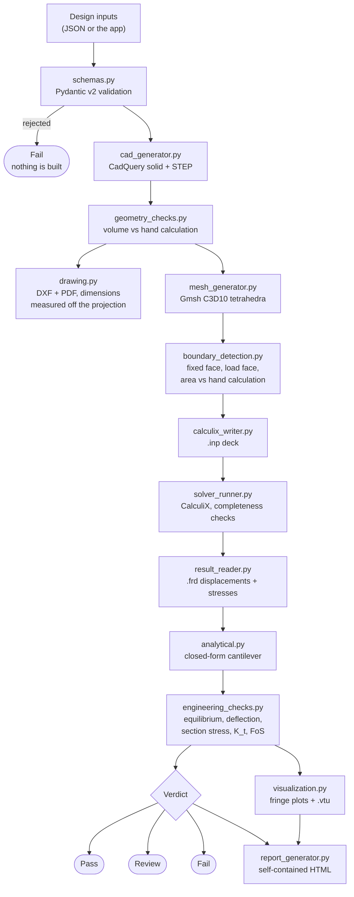

# Architecture

Units throughout: mm, N, MPa (N/mm²), tonne/mm³ for density, mass in kg.

## The shape of the problem

The pipeline turns a set of numbers into a verdict. Each stage hands the next
one something concrete — a solid, a file, an array — and each stage checks its
own output against something computed independently.

`pipeline.py` orchestrates the sequence and `app.py` is a thin interface over
it. `logging_utils.py` keeps one record that goes to both `run_log.txt` and the
interface, so the two cannot drift apart.

## Module responsibilities

| Module | Responsibility |
|---|---|
| `schemas.py` | The gatekeeper. Pydantic v2 models, cross-field geometric conflicts, and the errors/warnings split |
| `cad_generator.py` | Builds the solid, exports and re-imports STEP |
| `geometry_checks.py` | Recomputes the expected geometry from first principles and compares. Also home to `CheckResult` |
| `drawing.py` | First-angle projections, DXF and PDF, dimensions measured back off the projection |
| `mesh_generator.py` | Gmsh meshing, mesh statistics and mesh checks |
| `boundary_detection.py` | Finds the restrained and loaded faces by coordinate; builds equivalent nodal forces |
| `calculix_writer.py` | Writes the CalculiX deck |
| `solver_runner.py` | Runs CalculiX and decides whether it actually succeeded |
| `result_reader.py` | Parses `.frd` and `.dat`; extracts deflection and section stress |
| `analytical.py` | Closed-form cantilever reference |
| `engineering_checks.py` | Is the answer right, is the design good, and the verdict |
| `visualization.py` | Off-screen renders, verified non-blank, plus the `.vtu` |
| `report_generator.py` | Self-contained HTML report |
| `logging_utils.py` | One log, two destinations |
| `pipeline.py` | Orchestration, run folders, convergence study |

`pipeline.py` exists so the sequence
is testable without starting Streamlit, and so the report generator does not
have to duplicate it.

## Three principles the code follows

### 1. Every check compares against something computed independently

A stage never validates itself using the same logic that produced the result.
The volume is compared with a hand calculation, not with another CAD query. The
face areas are compared with `b·H − holes`, worked out from the inputs. The
deflection is compared with beam theory. The drawing's dimensions are measured
off the projected geometry and compared with the inputs, so the check is not
circular.

The builder and the inspector are separate modules for the same reason: a
builder that validates its own output tends to confirm its own assumptions.

### 2. Tolerances are set from what must be detected

Not from what the code currently achieves. The volume check runs at 1e-4
relative because the smallest thing it must catch — a missing fillet — is 0.74%
of the section, about 74× the threshold. Tightening it to 1e-6 would pass today
at exactly zero error and risk a false Fail after a CAD kernel upgrade.

The same reasoning sets the face-area tolerance at 1%: a wrong face is out by
hundreds of percent, while hole faceting legitimately moves the area by a
fraction of a percent.

The tip-deflection check is not a percentage at all. It is a band between the
beam and plate stiffness bounds, which is a physical statement rather than an
arbitrary number.

### 3. Failures are classified, not lumped together

Each check carries a severity:

- **critical** → Fail. The result cannot be believed, or the design misses its
  criterion. Equilibrium, geometry, solver, factor of safety.
- **advisory** → Review. The run is usable but needs a human eye. A marginal
  mesh, a deviation from beam theory, an implausible K_t.

A critical failure always outranks advisories, and the verdict never upgrades
itself. Collapsing the two would either cry wolf on every marginal mesh or hide
a model that is not in equilibrium.

## Keeping the pipeline general

Product-specific knowledge is deliberately confined to four modules:
`schemas.py` (what a bracket is), `cad_generator.py` (how to build one),
`boundary_detection.py` (which faces matter) and `analytical.py` (what the
closed-form answer is). Meshing, solving, result reading, reporting and
visualisation know nothing about brackets — they work on solids, meshes and
result arrays.

Adding a different component would mean writing those four modules and reusing
the rest.

## Conventions relied on across modules

**Coordinates.** x runs outward from the wall with the plate's rear face — the
fixed face — at x = 0. y runs across the width, centred on zero. z is up, with
the arm's underside at z = 0. Several stages find faces by coordinate, so this
is a contract, not an incidental detail.

**Free arm length.** L is measured from the *front* face of the plate, so the
arm's solid box spans x = 0 to t + L while its free length is L. Building it L
long overall would put every analytical comparison out by one thickness.

**Element ordering.** meshio's `tetra10` ordering matches CalculiX's C3D10
exactly, so elements are written unpermuted. This is verified by a test rather
than assumed, because a wrong permutation still solves and simply gives the
wrong answer.

## Failure handling

Every pipeline stage is wrapped so a failure produces a readable reason and a
Fail verdict, not a traceback in the interface. Two things deliberately do not
end a run:

- A failed **render** warns and continues. Pictures are presentation; losing
  them must not discard a valid analysis.
- A failed **drawing** warns and continues, for the same reason. Its dimension
  *check*, however, is critical: a mismatch means the solid and the inputs have
  diverged.

## Testing

379 tests, about 40 seconds. One test file per module.

Every check has a matching test that proves it can **fail**. A check that has
only ever passed is not evidence of anything — and three real bugs were caught
exactly this way (see [engineering-notes.md](engineering-notes.md)).

The CalculiX tests fail rather than skip when `CCX_PATH` is missing. A skipped
test prints a quiet `s` that everyone reads as a pass, which would hide a
broken toolchain.
